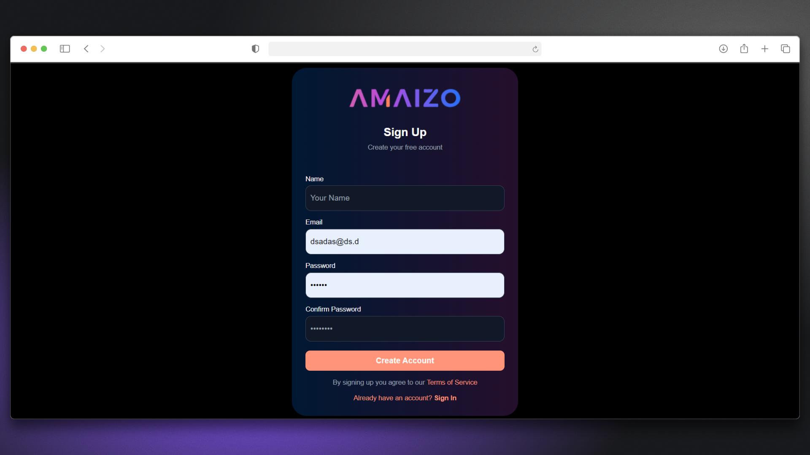
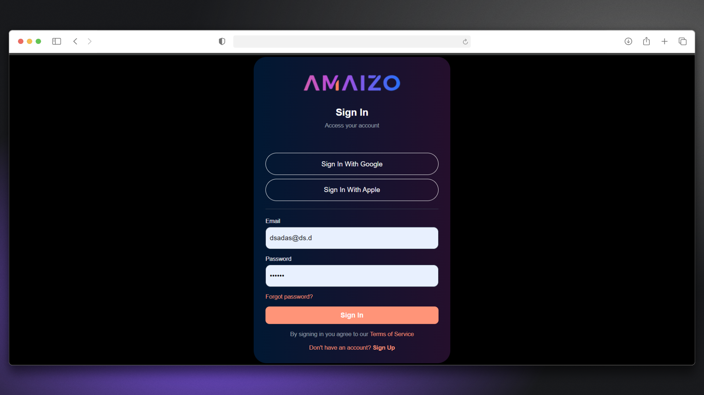
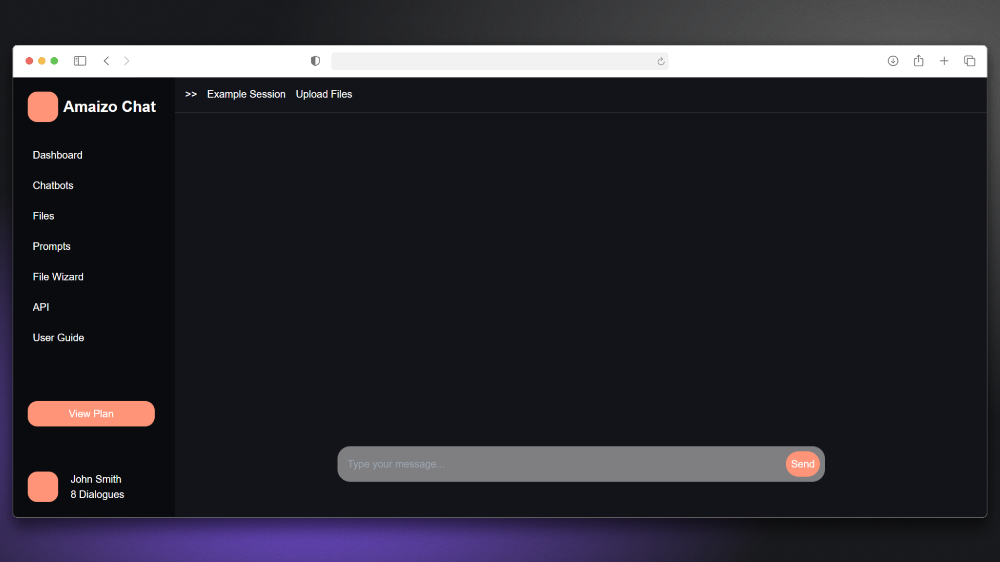

# 🤖 Amaizo Chat Bot

## 📌 Overview

The **Amaizo Chat Bot** is a modern AI-powered chat application built using **React / Next.js (or your stack)**.  
It allows users to interact with an intelligent chatbot that generates real-time responses in a smooth and responsive UI.

This project focuses on integrating AI APIs, handling chat state, and building a clean conversational interface.

---

## 🚀 Live Demo

🔗 https://amaizo-chat-bot.vercel.app/

---

## 🎯 Key Features

- 💬 Real-time AI chat interface  
- ⚡ Fast response generation  
- 🧠 AI-powered conversations  
- 📱 Fully responsive design  
- 🧾 Clean chat history UI  
- 🔄 Smooth message updates  

---

## 🧰 Tech Stack

- React / Next.js  
- Tailwind CSS (or CSS)  
- AI API (OpenAI or similar)  
- Vercel Deployment  

---

## 🧭 How to Use the Application

### 1️⃣ Home Page

- Landing page of the application  
- Brief introduction about Amaizo Chat Bot  
- Navigation to authentication pages  

  

---

### 2️⃣ Sign Up

- Create a new account  
- Enter required user information  
- Submit registration form  

  

---

### 3️⃣ Sign In

- Login using existing credentials  
- Authenticate user session  
- Redirect to chat interface  

  

---

### 4️⃣ Chat Interface

- Start real-time conversation with AI  
- Send messages and receive instant responses  
- Clean and interactive chat UI  

  

---

### 5️⃣ Result / Response

- AI-generated responses displayed clearly  
- Conversation history maintained  
- Smooth user experience  

  

